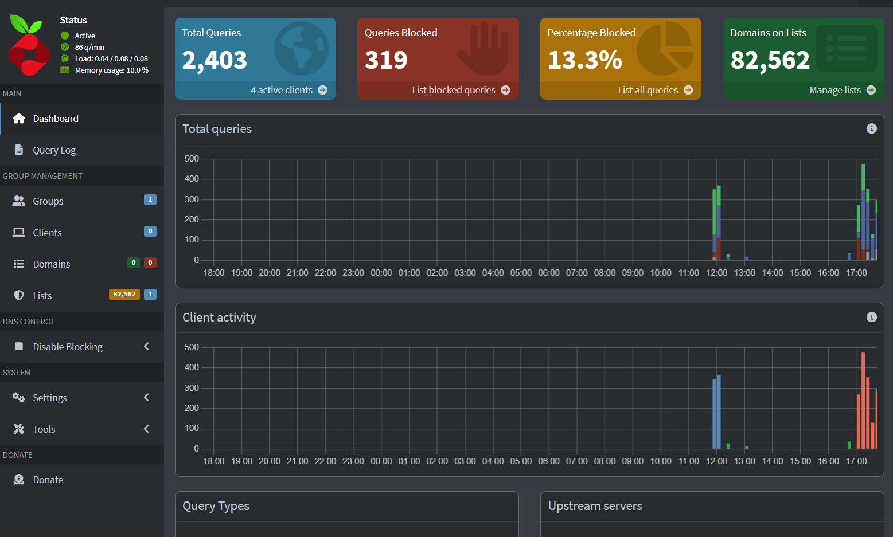
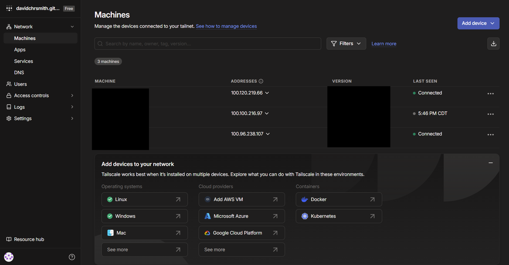
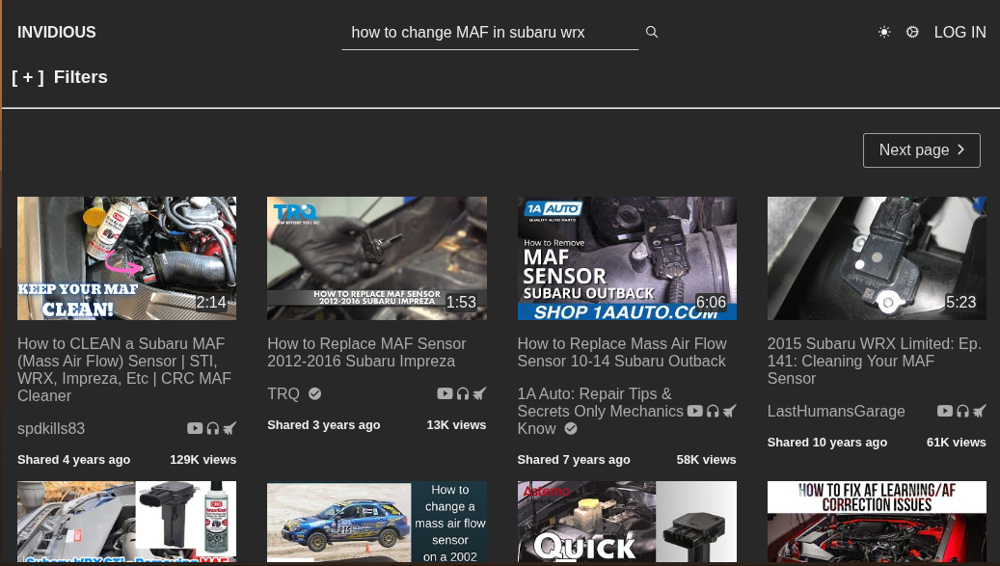

# personal-homelab

A Raspberry Pi-based personal homelab providing network-wide DNS filtering ([Pi-hole](https://pi-hole.net/)), secure remote access ([Tailscale](https://tailscale.com/)), and an ad-free YouTube front-end ([Invidious](https://invidious.io/)). Pi-hole and Invidious run as separate Docker Compose stacks; Tailscale runs natively on the host and is configured to route the whole tailnet's DNS through Pi-hole and to publish Invidious over the tailnet, so both follow your devices wherever they are.


## Services

| Service | How it runs | Docs |
|---|---|---|
| [Pi-hole](./services/pihole/README.md) | Docker container ([`docker-compose.yaml`](./services/pihole/docker-compose.yaml)) | Network-wide DNS filtering + admin UI |
| [Tailscale](./services/tailscale/README.md) | Native systemd service | Private mesh VPN, tailnet-wide DNS |
| [Invidious](./services/invidious/README.md) | Docker Compose stack ([`docker-compose.yaml`](./services/invidious/docker-compose.yaml)) | Ad-free YouTube front-end, tailnet-only |

## Documentation

- [Architecture](./docs/architecture.md) — components, diagram, and request flow
- [Networking](./docs/networking.md) — ports, IPs, and DNS resolution paths
- [Security](./docs/security.md) — secrets, exposure, and hardening notes

## Screenshots

| Pi-hole dashboard | Tailscale admin console | Invidious homepage |
|---|---|---|
|  |  |  |

## Getting started

```bash
git clone <this-repo>
cd personal-homelab

# Pi-hole
cd services/pihole
cp .env.example .env   # fill in your timezone and Pi-hole admin password
docker compose up -d
cd ../..

# install Tailscale natively and join the tailnet
curl -fsSL https://tailscale.com/install.sh | sh
sudo tailscale up

# Invidious (optional, ad-free YouTube over the tailnet)
cd services/invidious
cp .env.example .env   # fill in secrets, see services/invidious/README.md
docker compose up -d
sudo tailscale serve --bg https / http://127.0.0.1:3000
cd ../..
```

Once Pi-hole is running, view the admin dashboard at `http://<raspberry-pi-ip>:8080/admin` (plain HTTP, no TLS is configured — reachable from the LAN or the tailnet only). Invidious is reachable only at the `*.ts.net` hostname printed by `tailscale serve status` — never on the LAN or public internet.

See the individual service docs above for configuration details, ports, and how DNS is wired between the LAN and the tailnet.
