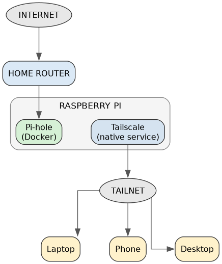
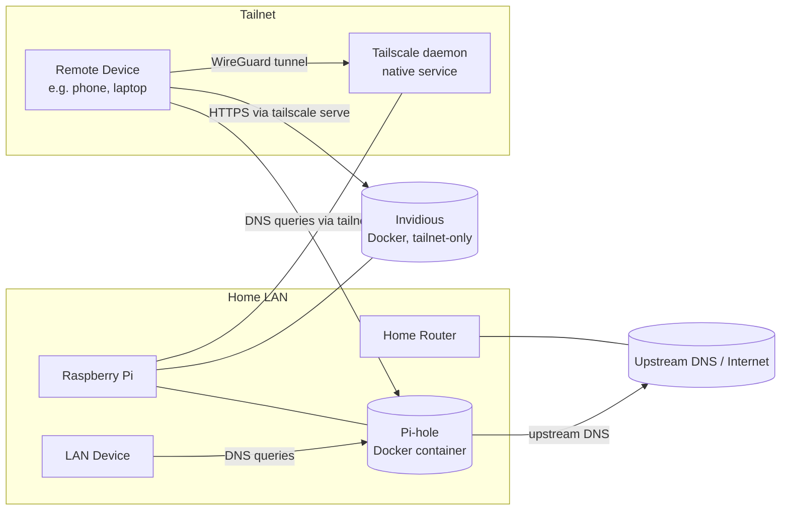

# Architecture

This homelab runs on a single Raspberry Pi and provides three functions: network-wide DNS filtering (Pi-hole), secure remote access (Tailscale), and an ad-free YouTube front-end (Invidious). Pi-hole and Tailscale are linked so that ad-blocking DNS filtering applies not just to devices on the home LAN, but to any device on the tailnet, wherever it is. Invidious is published over that same tailnet via `tailscale serve`.

## Components

| Component | Runs as | Purpose |
|---|---|---|
| Pi-hole | Docker Compose stack (`services/pihole/docker-compose.yaml`) | DNS resolver / sinkhole that blocks ads and trackers for all clients that use it |
| Tailscale | Native systemd service (installed directly on the Pi's OS, not containerized) | Creates a private mesh VPN (tailnet) so remote devices can securely reach the Pi and use it as their DNS server, and publishes Invidious over the tailnet |
| Invidious | Docker Compose stack (`services/invidious/docker-compose.yaml`) — `invidious` + `invidious-companion` + `invidious-db` (Postgres) | Ad-free, privacy-respecting YouTube front-end; tailnet-only via `tailscale serve` |

Tailscale runs natively rather than in Docker because it needs to manage host networking/routing directly (WireGuard interface, IP forwarding), which is simpler and more reliable outside a container.

Pi-hole and Invidious are deliberately kept in **separate Docker Compose stacks/folders** rather than one shared compose file. Pi-hole is critical infrastructure (DNS for the whole household); Invidious is not. Isolating them means updating, restarting, or debugging Invidious can never have any blast radius on DNS.

## High-level diagram

Editable source: [diagrams/network-architecture.drawio](../diagrams/network-architecture.drawio) (open with [draw.io](https://app.diagrams.net/) / the [Draw.io Integration](https://marketplace.visualstudio.com/items?itemName=hediet.vscode-drawio) VS Code extension).

## Request flow

1. **LAN client** sends a DNS query to the Pi's LAN IP (Pi-hole listens on port 53).
2. **Remote/tailnet client** connects to the tailnet over Tailscale's encrypted WireGuard tunnel, and is configured (via Tailscale's DNS settings) to use the Pi as its DNS server too.
3. Pi-hole checks the query against its blocklists:
   - If blocked, it returns a sinkholed response (ad/tracker blocked).
   - If allowed, it forwards the query to the configured upstream DNS resolver and returns the result.
4. All other traffic (actual web/app traffic) flows normally over the LAN or internet; only DNS resolution is routed through Pi-hole.

Invidious follows a separate, unrelated request path: `tailscale serve` reverse-proxies HTTPS traffic from the tailnet straight to the `invidious` container — it is never involved in DNS resolution and isn't reachable from the LAN or public internet. See [services/invidious/README.md](../services/invidious/README.md) for details.

## Why this design

- **Single point of DNS control**: One Pi-hole instance filters ads/trackers for both local and remote devices, instead of maintaining separate configurations per network.
- **No exposed services**: Tailscale means the Pi-hole admin UI and the Pi itself don't need to be exposed to the public internet — access is only possible through the private tailnet or the local LAN.
- **Simple, low-power hardware**: A Raspberry Pi is enough to run both workloads since DNS filtering and VPN traffic are lightweight.

See [networking.md](./networking.md) for IP/port details and [security.md](./security.md) for the security model.
