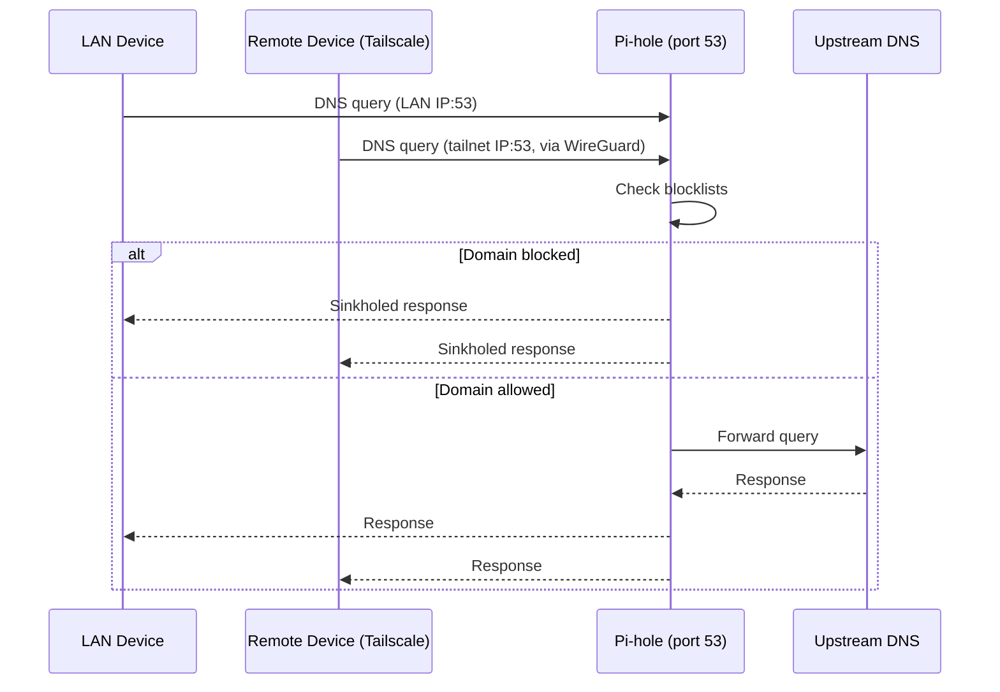

# Networking

## Overview

The Pi has two "network faces":

- Its **LAN interface**, reachable by any device on the home network.
- Its **Tailscale interface** (`tailscale0`), reachable only by devices authenticated into the same tailnet, over an encrypted WireGuard tunnel — regardless of where those devices physically are.

Both faces can reach Pi-hole for DNS resolution.

## Pi-hole

Defined in [`docker-compose.yaml`](../docker-compose.yaml):

| Port | Protocol | Purpose |
|---|---|---|
| 53 | TCP/UDP | DNS service — clients point their DNS at this port |
| 8080 → 80 | TCP | Pi-hole web admin UI (`http://<pi-ip>:8080/admin`) |

Pi-hole listens in `all` mode (`FTLCONF_dns_listeningMode=all`), so it accepts DNS queries from any interface on the Pi — including the LAN and the `tailscale0` Tailscale interface. This is what allows tailnet devices to use it as their resolver as well as LAN devices.

## Tailscale

Installed natively (not in Docker) so it can manage the WireGuard interface and routing on the host directly.

- Devices join the tailnet by running `tailscale up` and authenticating against the tailnet's identity provider.
- The Pi-hole's DNS service is made available to the rest of the tailnet by configuring Tailscale's DNS settings (in the [Tailscale admin console](https://login.tailscale.com/admin/dns)) to use the Pi's tailnet IP as a **global nameserver**, so every tailnet device — not just the Pi — resolves DNS through Pi-hole.
- Because the Pi's tailnet IP is stable (Tailscale assigns a fixed 100.x.x.x address per device), this nameserver configuration doesn't need to change when the Pi's LAN IP changes.

## DNS resolution paths

## Notes / things to keep in mind

- The Pi-hole admin UI (port 8080) is only bound to the host; it is **not** exposed to the public internet. The only ways to reach it are the LAN or the tailnet.
- If the Pi's LAN IP changes (e.g. DHCP lease renewal), LAN devices that manually point at it for DNS will need updating — a static DHCP reservation for the Pi is recommended.
